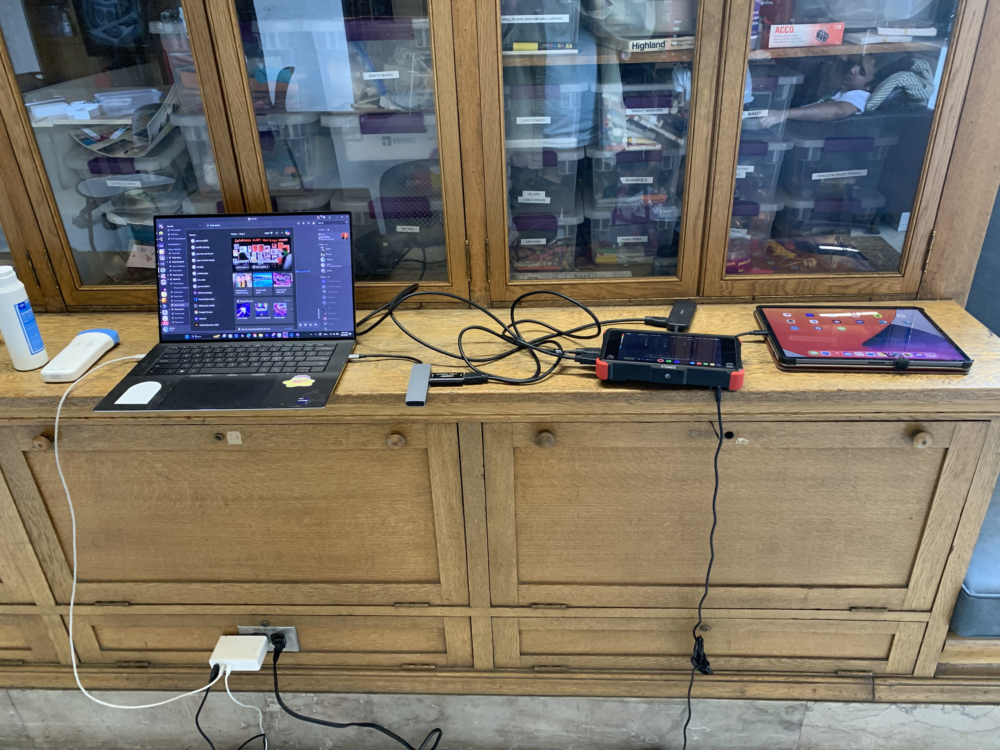
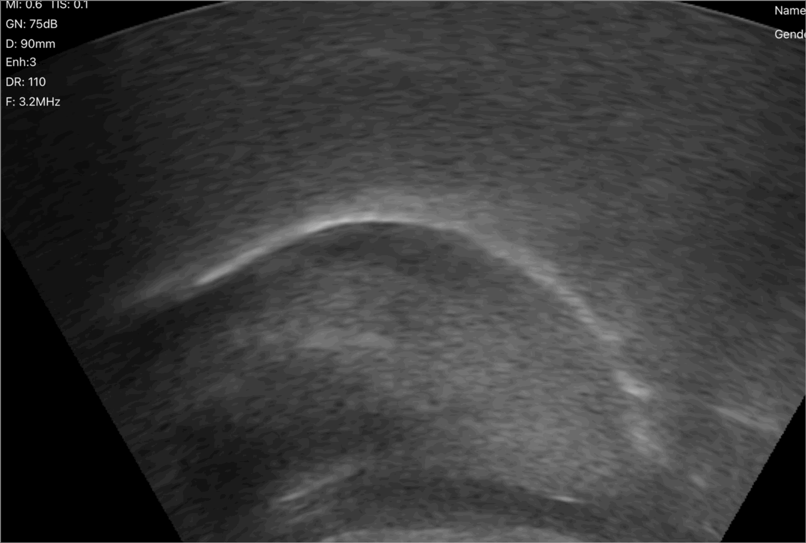
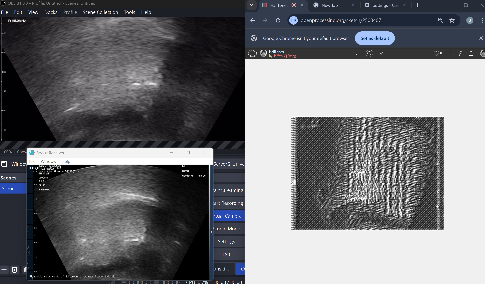

# ultrasonic_tongue_imaging

A realtime ultrasound tongue recognition system with an indexical reimaging of the phontice alphabet with ultrasound tongues.

The inspiration of the project was the memory of my sister using an ultrasound to documentm my heart beat as practice during medical school. I was also draw to the granular texture of the ultrasound alongside the ability to collect my own dataset for the project. I was working on a lego dataset with the 45,000 images and utilizing T-SNE and U-Mapping to discover an underlaying pattern of similar shaped legos and color. 

My painting practice consisit of figurative and self portraiture, and I wanted to represent the sense of self by looking and exploring the inside of the body instead of the outside. 

This project started out as just an exploration of what I could capture from inside the body that was readibly available. Originally, I wanted to have a camera placed within my mouth, which lead to me thinking about different way to see the body through MRIs, x-rays, and ultrasounds. 

# Methology

https://pmc.ncbi.nlm.nih.gov/articles/PMC9689563/

After looking at soem research paper on ultrasound tongue imaging and phonetic sounds in speech therapy. I decide that I would be using the ultrasound to collect images and video of my tougue as I read out words and phrases. I will uses an neural network like a tensorflow model created using Teachable machine to correlate ultrasound images relate phonetics sounds, words, and phrases with differnet ultrasound images such that i can predict what I am saying and explore censorship of words. I am thinking of making a screen printed pamplet with an alphabet of ultrasound images. I am also interested in tinkering with ultrasonic imaging of the eyes.

# Set up

Originally I wanted to use airplay and screenshare my ipad or ios device to my laptop. I found a free 30 day trial for AirServers that worked for my ipad and windows laptop. 

Original Pipeline:
- Ultrasound Connects to Ipad
- Screenrecord video on Ipad
- Ipad AirServer mirror screen to Laptop AirServer
- OBS Virtual Camera exports Laptop AirServer
- OBS virtual Camera into p5js sketch or Teachable Machine

I also tried to use Spout to export the OBS virtual camera as a texture on the GPU and run the tensorflow model locally. I installed the spout pluggin and the python packet, but I have not figured out how to run tensorflow models locally with CUDA. 

Important Note: You will need to run OBS, Spout, Chrome (I find it to work best), and AirServer to make images visible. This process is not realtime. 

## Realtime Solution

With the help of the Studio of Creative Inquiry, I was able to borrow a **ninjaFlame**, a hdmi to hdmi screen capture device, and a **video capture card**. One problem that I found with my orginal pipeline was that in order to connect with the hand-held ultrasound, the device need to be connected with the wire router of the ultrasound device. This would cut off the internet connect need for screen share application like AirServers to share between devices. 

Hardware Realtime Solution:
Ipad -> usb-c to hdmi apdapter -> hdmi cord -> ninjaFlame -> hdmi cord -> hdmi in video capture card -> usb adapter -> window laptop

A standard laptop does not have teh ability to process hdmi-in video input and can only take hdmi-out output as in sharing screens. The ninjaFlame screenshares the ipad screen as an hdmi signal. The video capture card is essential in taking the hdmi signal to be a usable video capture that a windows laptop can use. 

OBS -> video capture -> USB Video -> Virtual Camera -> Any application 

One Problem that I found was that Teachable machine did not connect with the OBS virtual camera even with permission setting and turning on graphics acceleration. 

### Full setup

# Initial Imaging

# Pipe-line with OBS 

# P5js + Teachable Machine

https://youtube.com/shorts/aQSqmPdArYM

# Screenprinting

Labor: Screen Printed Flipbook 
https://youtu.be/g427GR-Lbww

# Next Steps 

