

  <table style="border-collapse: collapse; border: none;">
    <tr>
      <td style="border: none; padding:4;">
        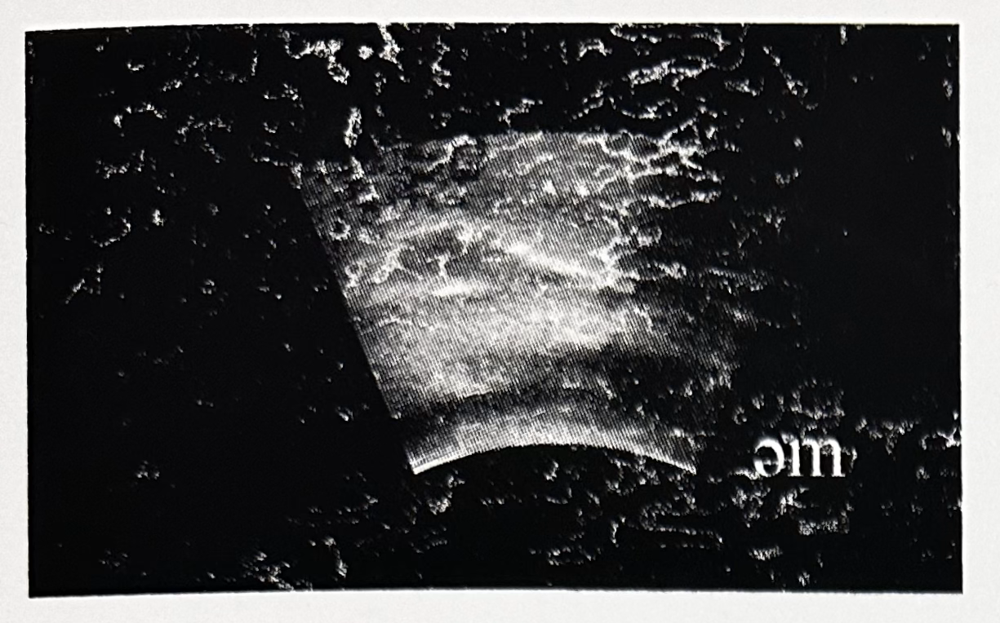
      </td>
      <td style="border: none; padding: 4;">
        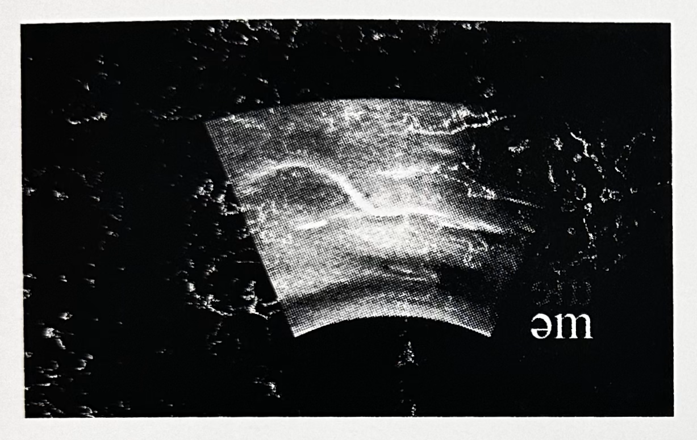
      </td>
      <td style="border: none; padding: 4;">
        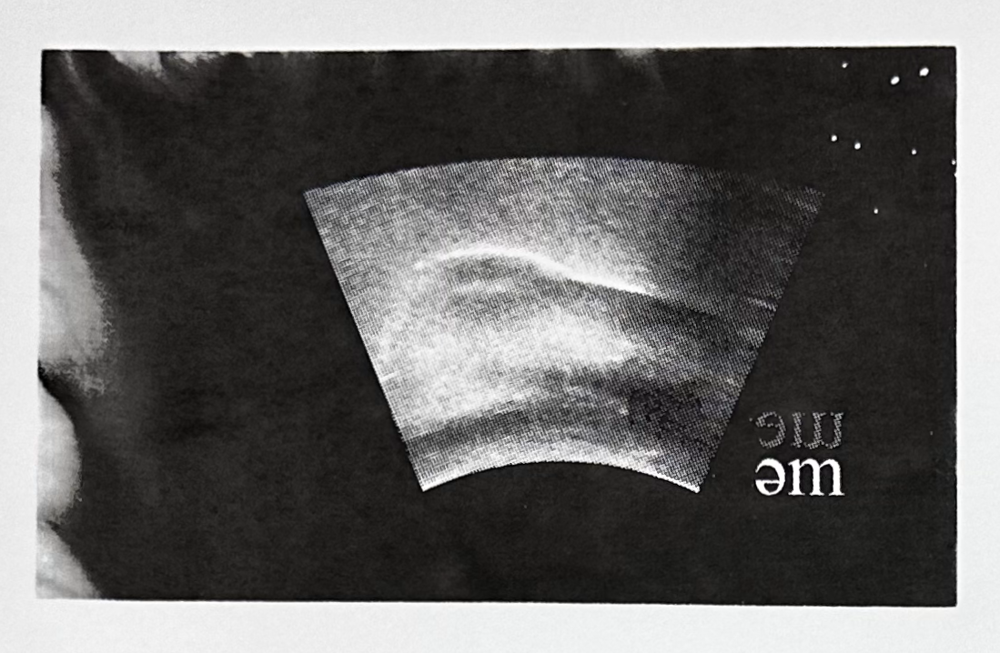
      </td>
      <td style="border: none; padding: 4;">
        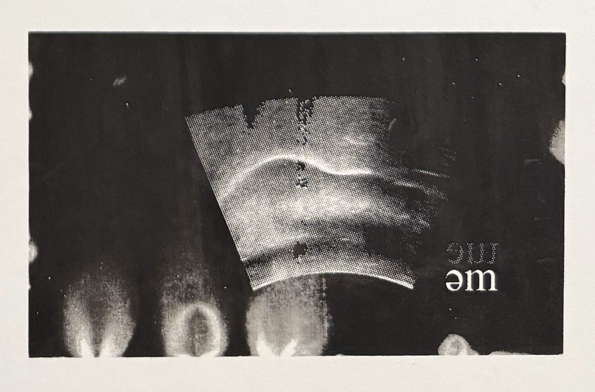
      </td>
    </tr>
  </table>

# Ultrasonic_Tongue_Imaging

A real-time ultrasound tongue recognition system with an indexical reimagining of the phonetic alphabet. with ultrasound tongues. The inspiration of the project was the memory of my sister using an ultrasound to document my heartbeat as practice during medical school. I was also drawn to the granular texture of the ultrasound alongside the ability to collect my own dataset for the project. I was working on a lego dataset with the 45,000 images and utilizing t-SNE and UMAP to discover an underlaying pattern of similar shaped legos and color. My painting practice consists of figurative and self portraiture, and I wanted to represent the sense of self by looking and exploring the inside of the body instead of the outside. This project started out as just an exploration of what I could capture from inside the body that was readily available. Originally, I wanted to have a camera placed within my mouth, which lead to me thinking about different ways to see the body through MRIs, x-rays, and ultrasounds.

## Model Pipeline

  <table>
    <tr>
      <td style="padding: 10px;">
        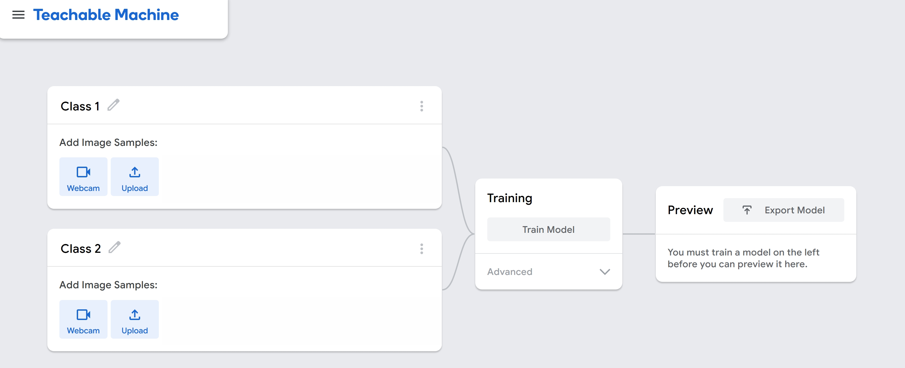
      </td>
      <td style="padding: 10px;">
        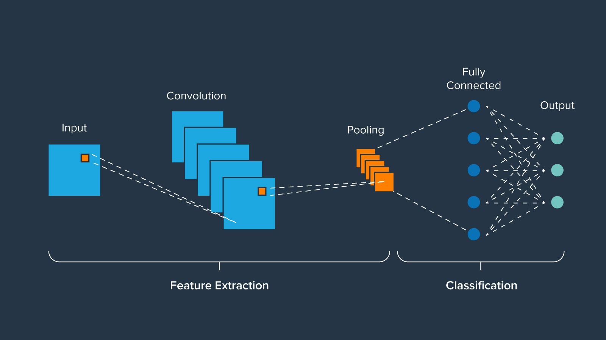
      </td>
    </tr>
  </table>

  

    <em>
      Overview of the CNN image classification pipeline used for ultrasound
      tongue recognition.
    </em>
  

This project uses Google Teachable Machine’s image classification model, which is built on TensorFlow and uses a convolutional neural network, or CNN. I trained the model on labeled ultrasound images of tongue positions associated with different phonetic sounds.The CNN processes batches of images and learns visual features such as edges, textures, brightness patterns, and shapes. These learned features are represented internally as feature vectors, which allow the classifier to compare new ultrasound frames against the labeled training classes.

When the model receives a new ultrasound image, it predicts which phonetic class the image most closely matches and returns a confidence score for each class. During training, the model calculates prediction error and updates its internal weights over multiple epochs, gradually improving its ability to associate ultrasound tongue shapes with the correct phonetic labels.

# Methodology

https://pmc.ncbi.nlm.nih.gov/articles/PMC9689563/

https://github.com/golanlevin/ImageRearranger

After looking at some research paper on ultrasound tongue imaging and phonetic sounds in speech therapy. I decided that I would be using the ultrasound to collect images and video of my tongue as I read out words and phrases. I used a neural network like a tensorflow model created using Teachable Machine to correlate ultrasound images with phonetics sounds, words, and phrases with different ultrasound images such that i can predict what I am saying and explore censorship of words. I am thinking of making a screen printed pamphlet with an alphabet of ultrasound images. I am also interested in tinkering with ultrasonic imaging of the eyes.

# Setup

Originally I wanted to use airplay and screen share my ipad or ios device to my laptop. I found a free 30 day trial for AirServers that worked for my ipad and windows laptop.

Original Pipeline:

- Ultrasound Connects to Ipad
- Screenrecord video on Ipad
- Ipad AirServer mirror screen to Laptop AirServer
- OBS Virtual Camera exports Laptop AirServer
- OBS virtual Camera into p5.js sketch or Teachable Machine

I also tried to use Spout to export the OBS virtual camera as a texture on the GPU and run the tensorflow model locally. I installed the spout plugin and the python packet, but I have not figured out how to run tensorflow models locally with CUDA.

## Full setup

  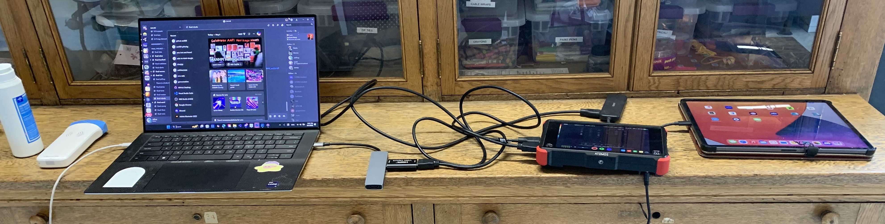

## Real-Time Solution

With the help of the Studio of Creative Inquiry, I was able to borrow a **ninjaFlame**, a hdmi to hdmi screen capture device, and a **video capture card**. One problem that I found with my original pipeline was that in order to connect with the hand-held ultrasound, the device needed to be connected with the wire router of the ultrasound device. This would cut off the internet connection needed for screen share application like AirServers to share between devices.

A standard laptop does not have the ability to process hdmi-in video input and can only take hdmi-out output as in sharing screens. The ninjaFlame screenshares the ipad screen as an hdmi signal. The video capture card is essential in taking the hdmi signal to be a usable video capture that a windows laptop can use.

  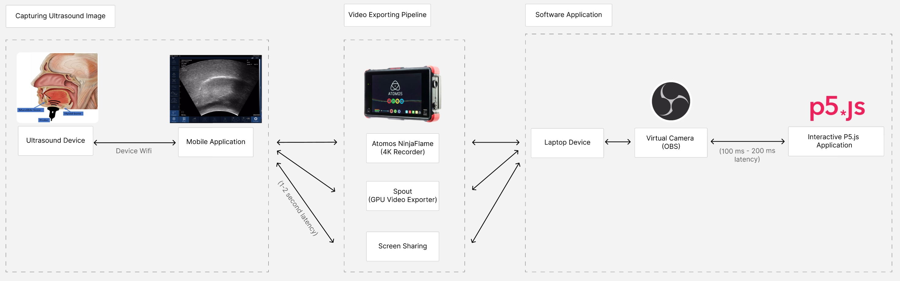
     
<em>Diagram of hardware and software production pipeline</em>

Important Note: You will need to run OBS, Spout, Chrome (I find it to work best), and AirServer to make images visible. This process is not realtime.

# Initial Imaging

- Using a Wireless Probe type Ultrasound Scanner with ultrasound gel, I was able to collect and pinpoint the best settings for displaying the tongue: by creating a vertical scan directly underneath the chin.

  <table>
    <tr>
      <td style="padding: 10px;">
        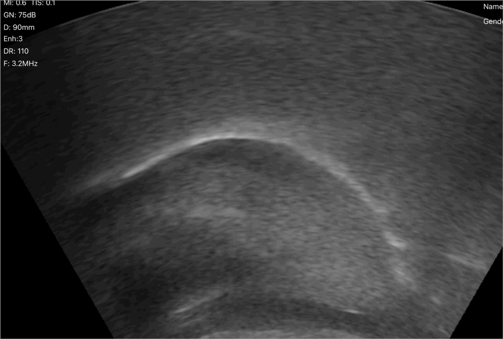
      </td>
      <td style="padding: 10px;">
        
      </td>
    </tr>
  </table>

# Pipe-line with OBS and Teachable Machine

  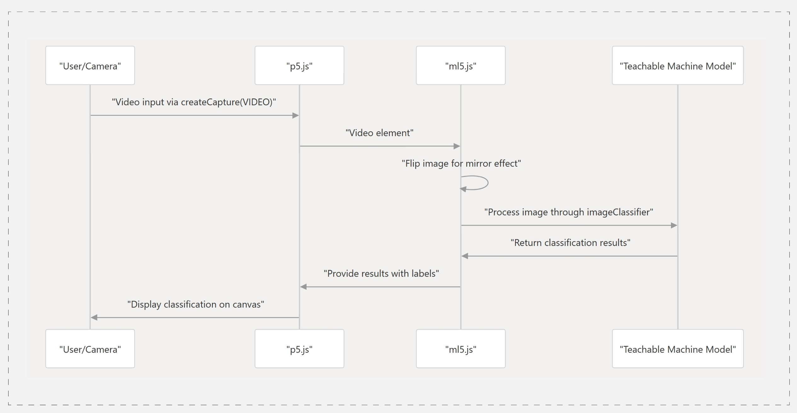

  
<em>Sequence diagram illustrating the interaction between the user, p5.js, ml5.js, and the Teachable Machine image classification model. The application continuously captures webcam frames, applies preprocessing to create a mirrored image, performs CNN-based inference using the trained Teachable Machine model, and returns the predicted tongue gesture labels for visualization on the user interface(Teachable Machine DeepWiki).</em>

  <table>
    <tr>
      <td align="center" style="padding: 12px;">
        
      </td>
      <td align="center" style="padding: 12px;">
        
      </td>
      <td align="center" style="padding: 12px;">
        
      </td>
    </tr>
  </table>

   
<em>The predicted tongue gesture labels for the specific phonetic sounds.</em>

I collected a dataset containing 3000 images of the 6 IPA short vowel sounds below:

- /ɪ/ – fit /fiːt/, pick /piːk/, difficult /ˈdɪ.fɪ.kəlt/

- /e/ – pet /pet/, sent /sent/, attention /əˈten.ʃən/

- /æ/ – pat /pæt/, flat /flæt/, family /ˈfæ.mə.li/

- /ʌ/ – cut /kʌt/ jump /dʒʌmp/, cover /ˈkʌ.vər/

- /ʊ/ – put /pʊt/, book /bʊk/, cushion /ˈkʊ.ʃən/

- /ɒ/ – pot /pɒt/, dog /dɒg/, hospital /ˈhɒs.pɪ.təl/

I uploaded the images and trained a trained a CNN image classifier using [Google Teachable Machine](https://teachablemachine.withgoogle.com/train/image) and integrated it with a Teachable Machine + TensorFlow integration as a test demo.

  <table>
    <tr>
      <td align="center" style="padding: 12px;">
        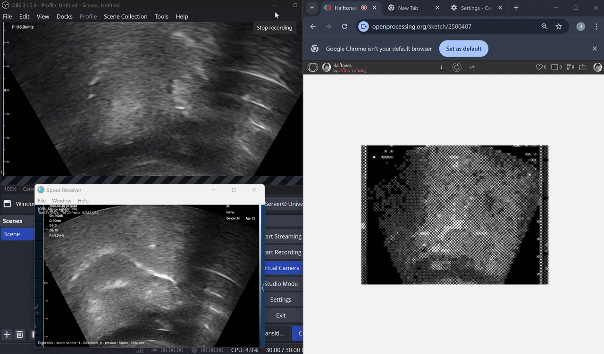
      </td>
      <td align="center" style="padding: 12px;">
        
      </td>
    </tr>
  </table>

   
<em>A real-time integration of OBS Virtual Camera in p5.js and outputting to a Spout receiver and. The p5.js application interface shown beside the live ultrasound demo.</em>

# p5.js

Shader work with shadertoy and p5.js libraries playing with visual textures. This visual exploration led to the inspiration of phonetic indexing and typology using ultrasound imaging.

<table>
  <tr>
    <td></td>
    <td></td>
  </tr>
  <tr>
    <td></td>
    <td></td>
  </tr>
</table>

# Screenprinting

Screenshots of ultrasound visualizations were inkjet-printed on acetate and then emulsified into a 180 mesh screen to be printed. 

<table>
  <tr>
    <td></td>
    <td></td>
    <td>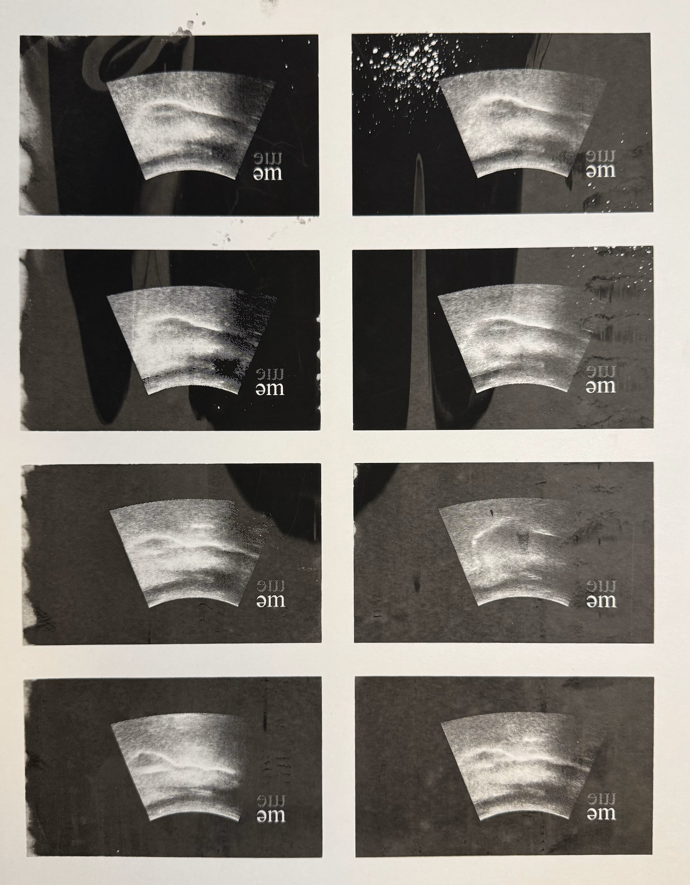</td>
    <td>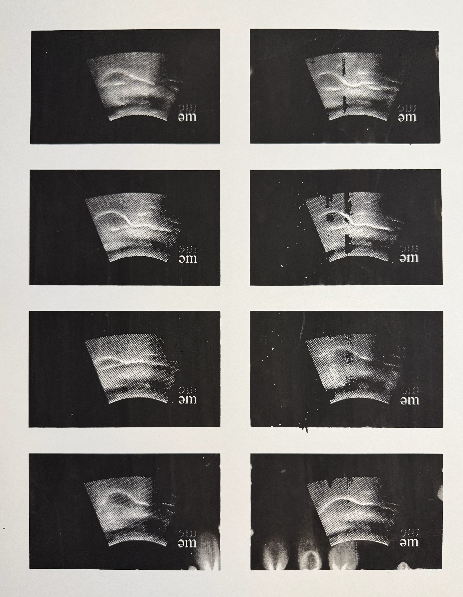</td>
  </tr>
</table>

<table>
  <tr>
    <td></td>
    <td>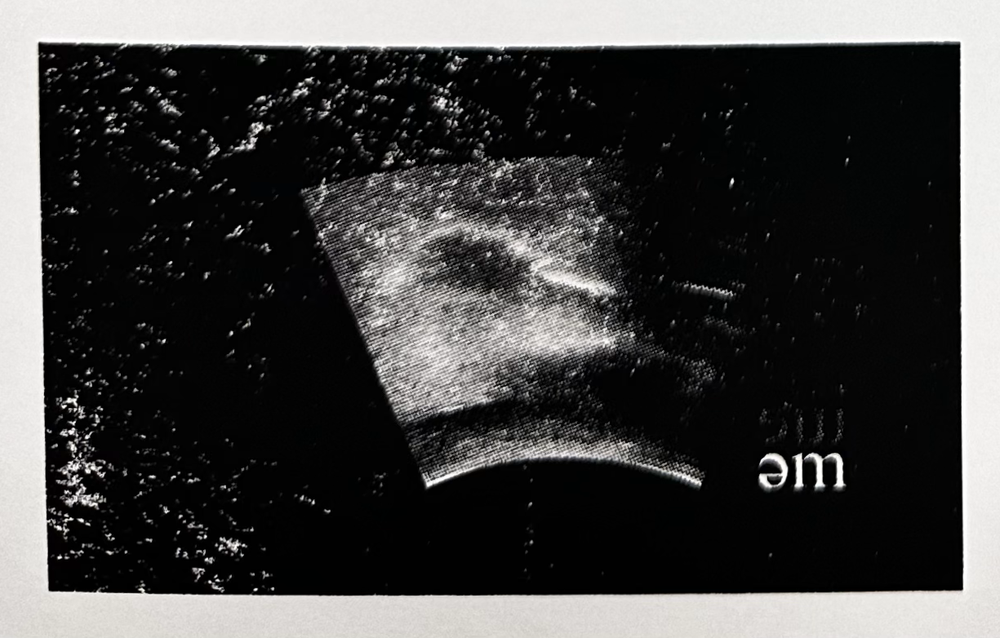</td>
    <td>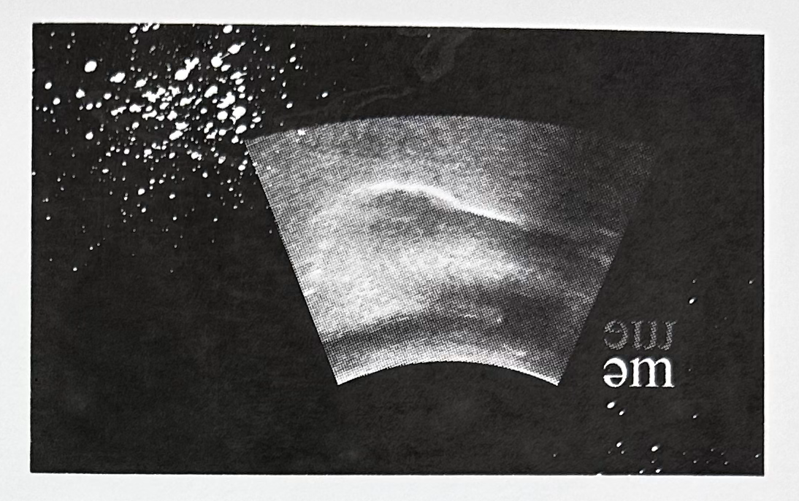</td>
    <td>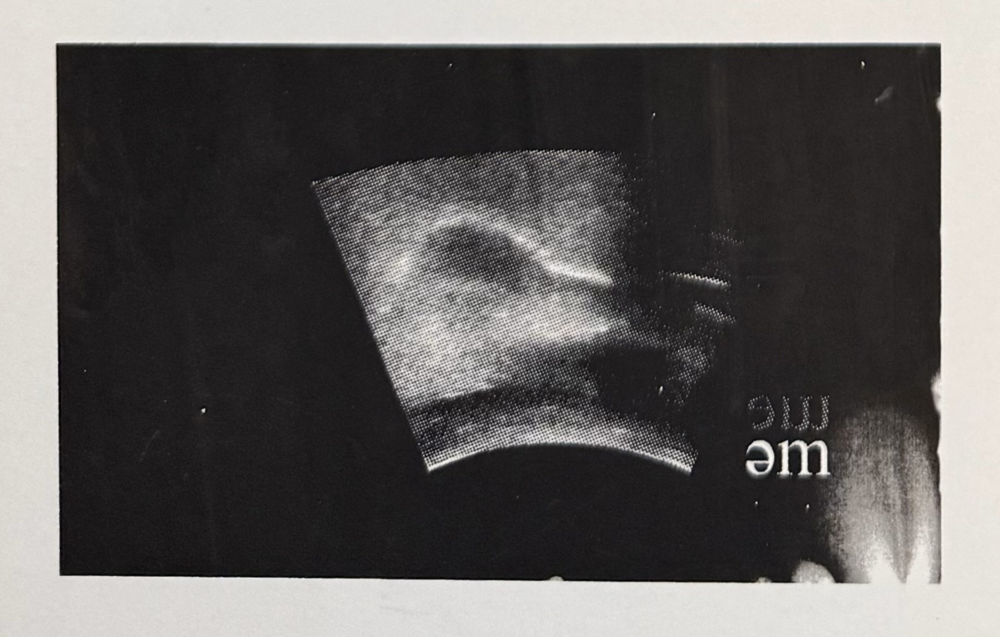</td>
  </tr>
   <tr>
    <td></td>
    <td></td>
    <td>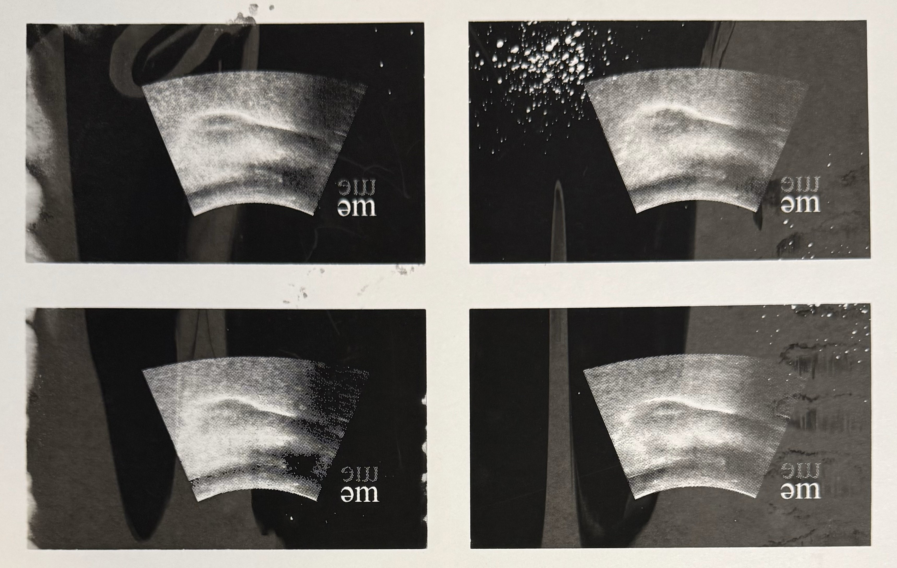</td>
    <td></td>
  </tr>
</table>

<em>Curated frames from a recording of the phrase "um" screenprinted on Bristol 80 lbs paper with a 180 mesh screen</em>

# Labor: Screen Printed Flipbook

  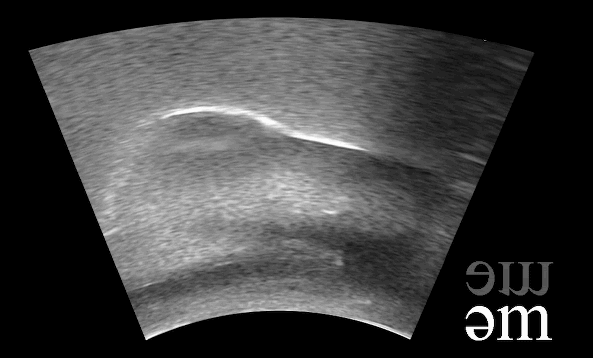
  
   
<em>Image scans of the completed 40 frame perfect-bound flipbook </em>

# Next Steps

My expectation going into this project was to get a working real-time integration between my ultrasound scanner and a javascript program, alongside a few prints for the projects. After collecting and processing my own dataset, I found that I really enjoyed images as a collection. As I continued to analyze larger imageset, I found myself filtering, sifting, and tailoring the data in increasingly manual ways and different media. I would love to create a t-SNE mosaic, a phontic alphabet print, train a GAN/Lora, a traversal of the latent space, and generate my own ultrasound images. Ultimately, I love the tension between having to select my favorite collection for a seemingly infinite amount of possibilities. The context of the thousands from which I selected these images now also has importance.
