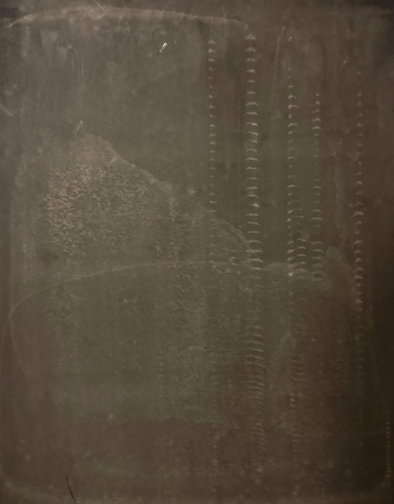

# Ultrasonic_Tongue_Imaging

A realtime ultrasound tongue recognition system with an indexical reimaging of the phontice alphabet with ultrasound tongues. The inspiration of the project was the memory of my sister using an ultrasound to documentm my heart beat as practice during medical school. I was also draw to the granular texture of the ultrasound alongside the ability to collect my own dataset for the project. I was working on a lego dataset with the 45,000 images and utilizing T-SNE and U-Mapping to discover an underlaying pattern of similar shaped legos and color. My painting practice consisit of figurative and self portraiture, and I wanted to represent the sense of self by looking and exploring the inside of the body instead of the outside.  This project started out as just an exploration of what I could capture from inside the body that was readibly available. Originally, I wanted to have a camera placed within my mouth, which lead to me thinking about different way to see the body through MRIs, x-rays, and ultrasounds. 

# Methology

https://pmc.ncbi.nlm.nih.gov/articles/PMC9689563/

https://github.com/golanlevin/ImageRearranger

After looking at soem research paper on ultrasound tongue imaging and phonetic sounds in speech therapy. I decide that I would be using the ultrasound to collect images and video of my tougue as I read out words and phrases. I will uses an neural network like a tensorflow model created using Teachable machine to correlate ultrasound images relate phonetics sounds, words, and phrases with differnet ultrasound images such that i can predict what I am saying and explore censorship of words. I am thinking of making a screen printed pamplet with an alphabet of ultrasound images. I am also interested in tinkering with ultrasonic imaging of the eyes.

# Set up

Originally I wanted to use airplay and screenshare my ipad or ios device to my laptop. I found a free 30 day trial for AirServers that worked for my ipad and windows laptop. 

Original Pipeline:
- Ultrasound Connects to Ipad
- Screenrecord video on Ipad
- Ipad AirServer mirror screen to Laptop AirServer
- OBS Virtual Camera exports Laptop AirServer
- OBS virtual Camera into p5js sketch or Teachable Machine

I also tried to use Spout to export the OBS virtual camera as a texture on the GPU and run the tensorflow model locally. I installed the spout pluggin and the python packet, but I have not figured out how to run tensorflow models locally with CUDA. 

Important Note: You will need to run OBS, Spout, Chrome (I find it to work best), and AirServer to make images visible. This process is not realtime. 

# Realtime Solution

With the help of the Studio of Creative Inquiry, I was able to borrow a **ninjaFlame**, a hdmi to hdmi screen capture device, and a **video capture card**. One problem that I found with my orginal pipeline was that in order to connect with the hand-held ultrasound, the device need to be connected with the wire router of the ultrasound device. This would cut off the internet connect need for screen share application like AirServers to share between devices. 

## Hardware Realtime Solution:
`Ipad` -> `Usb-c to hdmi apdapter` -> `Hdmi Cord` -> `NinjaFlame` -> `Hdmi cord` -> `Hdmi in Video Capture Card` -> `USB adapter` -> `Window laptop`

A standard laptop does not have teh ability to process hdmi-in video input and can only take hdmi-out output as in sharing screens. The ninjaFlame screenshares the ipad screen as an hdmi signal. The video capture card is essential in taking the hdmi signal to be a usable video capture that a windows laptop can use. 

`OBS` -> `Video Capture` -> `USB Video` -> `Virtual Camera` -> `Any application` 

One Problem that I found was that Teachable machine did not connect with the OBS virtual camera even with permission setting and turning on graphics acceleration. 

# Full setup

# Initial Imaging
- Using a Wireless Probe type Ultrasound Scanner with ultrasound gel, I was able to collect and pin point the best settings for displaying the tongue: by creating a vertical scann directly underneath the Chin. 
<table>
  <tr>
    <td></td>
  </tr>
  <tr>
    <td></td>
  </tr>
  <tr>
    <td></td>
  </tr>
</table>

# Pipe-line with OBS 

A real-time integration of OBS Virtual Camera in P5js and exporting to a Spout software receiver.

# P5js + Teachable Machine

Shader work with shadertoy and P5js libraries playing with visual textures. This visual exploration lead to the inspiration of phontic indexes and typology using ultrasound imaging. 
<table>
  <tr>
    <td></td>
    <td></td>
  </tr>
  <tr>
    <td></td>
    <td></td>
  </tr>
</table>

I collecting a data set containing 3000 images of the 6 IPA short vowel sounds below:

- /ɪ/ – fit /fiːt/, pick /piːk/, difficult /ˈdɪ.fɪ.kəlt/

- /e/ – pet /pet/, sent /sent/, attention /əˈten.ʃən/

- /æ/ – pat /pæt/, flat /flæt/, family /ˈfæ.mə.li/

- /ʌ/ – cut /kʌt/ jump /dʒʌmp/, cover /ˈkʌ.vər/

- /ʊ/ – put /pʊt/, book /bʊk/, cushion /ˈkʊ.ʃən/

- /ɒ/ – pot /pɒt/, dog /dɒg/, hospital /ˈhɒs.pɪ.təl/

I uploaded the images and trained a classification LLM using [Google Teachable Machine](https://teachablemachine.withgoogle.com/train/image) and integrated it with a Teachable Machine + Tensorflow integration as a test demo. 

# Screenprinting

- Curated frames from a recording of the phrase "um" screenprinted on Bristol 80 lbs paper with a 180 mesh screen. 
<table>
  <tr>
    <td></td>
    <td></td>
  </tr>
  <tr>
    <td></td>
    <td></td>
  </tr>
</table>

- The full block prints for the background of the flipbook
<table>
  <tr>
    <td></td>
    <td></td>
    <td></td>
  </tr>
</table>

# Labor: Screen Printed Flipbook 

Image scans of the completed 40 frame perfect-bound flipbook 

# Next Steps 

My expectation going into this project was to get a working real-time integration between my ultrasound scanner and a javascript program, alongside a few prints for the projects. After collecting my own dataset and process all of it, I found that I really enjoyed the textural quality of the the ultrasound images from the whole. As I continued to analyze it however, I found myself filtering, sifting, and tailoring the data in increasingly manual ways and different medium. I would love to screate a t-SEE mosiac, a phontic alphebet print, train a GAN/Lora, a traversal of the latent space, and generate my own ultrasound images. Ultimately, I love the tension between having to select my favorite collection for a seemingly infinite amount of possibilities. The context of the thousands from which I chose those the my images from makes them important. 

